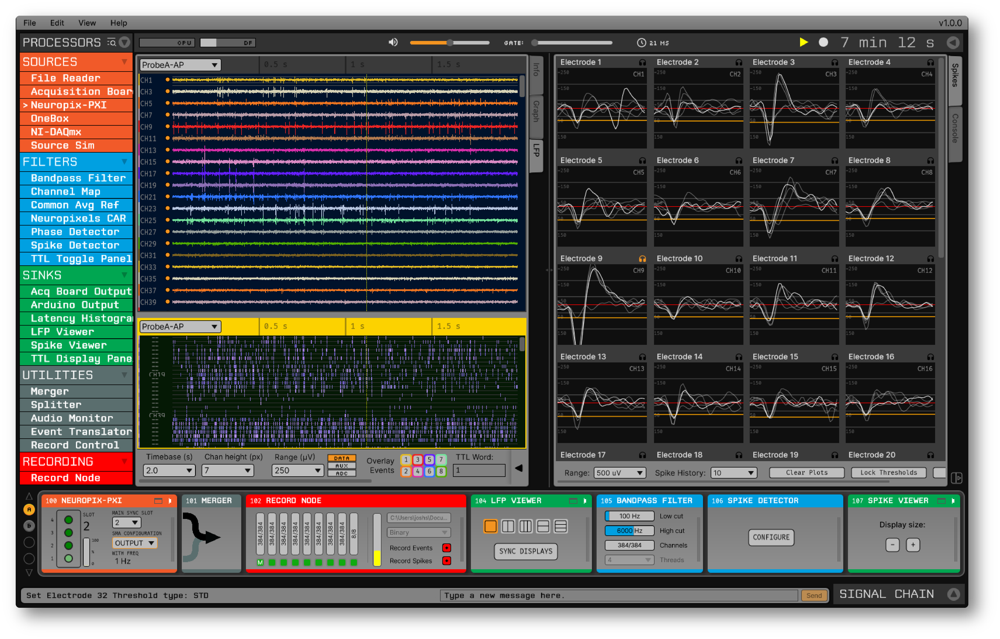

:notoc:

.. title:: Home

|

The **Open Ephys GUI** is an open-source, plugin-based application for acquiring extracellular electrophysiology data. It was designed by neuroscientists to make their experiments more flexible and enjoyable. It works equally well on macOS, Linux, and Windows, although
some plugins are only available for certain operating systems. 

Previously, the GUI's documentation lived on the `Open Ephys wiki <https://open-ephys.atlassian.net/wiki/spaces/OEW/pages/491527/Open+Ephys+GUI>`__, but almost all of the information from the wiki has now been migrated to this site.

.. raw:: html

     
    

        <a class="reference internal" href="User-Manual/Before-you-begin.html">
        

            
            

                <h5 class="card-title">Intro to Open Ephys</h5>
                
Read this if you're just starting out

            

        

        <a class="reference internal" href="User-Manual/Installing-the-GUI.html">
        

            
            

                <h5 class="card-title">Installing the GUI</h5>
                
How to get up and running

            

        

        <a class="reference internal" href="Developer-Guide/index.html">
        

            
            

                <h5 class="card-title">Developer Guide</h5>
                
How to modify and extend the GUI

            

        

        <a class="reference internal" href="Tutorials/index.html">
        

            
            

                <h5 class="card-title">Tutorials</h5>
                
Step-by-step instructions on various topics

            

        

    

.. toctree::
    :hidden:
    :maxdepth: 5
    :titlesonly:

    User-Manual/index
    Developer-Guide/index
    Tutorials/index
    FAQ/index
