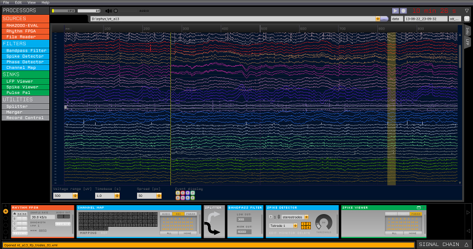

:notoc:

Open Ephys GUI
=================================================

.. **Date**: |today|

.. **Download documentation**: `PDF Version <open-ephys-documentation.pdf>`__ | `Zipped HTML <open-ephys-documentation.zip>`__

|

This is the new documentation site for the Open Ephys GUI, an open-source, plugin-based application for acquiring extracellular electrophysiology data.

The GUI was designed by neuroscientists to make their experiments more flexible and enjoyable. It works equally well on macOS, Linux, and Windows, although
some plugins are only available for certain operating systems. 

Previously, the GUI's documentation lived on the `Open Ephys wiki <https://open-ephys.atlassian.net/wiki/spaces/OEW/pages/491527/Open+Ephys+GUI>`__. 
We are planning to migrate all of the docs to this site over time.

.. raw:: html

    

        

            

                

                
                

                    <h4 class="card-title">Intro to Open Ephys</h5>
                    
Read this if you're just starting out.

.. container:: custom-button

    :ref:`Before you begin >><beforeyoubegin>`

.. raw:: html

                

                

            

            

                

                
                

                    <h4 class="card-title">Installing the GUI</h5>
                    
How to get up and running.

.. container:: custom-button

    :ref:`Installation >><installingthegui>`

.. raw:: html

                

                

            

            

                

                
                

                    <h4 class="card-title">Developer Guide</h5>
                    
How to contribute to the GUI.

.. container:: custom-button

    :ref:`Developer Guide >><developerguide>`

.. raw:: html

                

                

            

            

                

                
                

                    <h4 class="card-title">Tutorials</h5>
                    
Guided tours on a variety of topics.

.. container:: custom-button

    :ref:`Tutorials >><tutorials>`

.. raw:: html

                

                

            

        

    

.. toctree::
    :hidden:
    :maxdepth: 5
    :titlesonly:

    User-Manual/index
    Developer-Guide/index
    Tutorials/index
    FAQ/index
